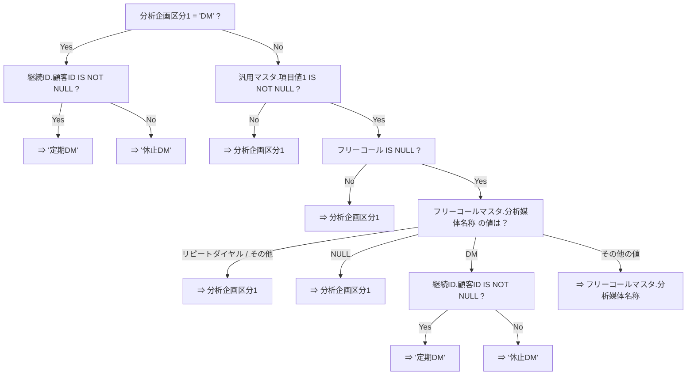

企画フローチャート

```mermaid
flowchart TD

A["分析企画区分1 = 'DM' ?"] -->|Yes| B["継続ID.顧客ID IS NOT NULL ?"]
B -->|Yes| B1["⇒ '定期DM'"]
B -->|No| B2["⇒ '休止DM'"]

A -->|No| C["汎用マスタ.項目値1 IS NOT NULL ?"]
C -->|No| Z["⇒ 分析企画区分1"]

C -->|Yes| D["フリーコール IS NULL ?"]

D -->|No| E["⇒ 分析企画区分1"]

D -->|Yes| F["フリーコールマスタ.分析媒体名称 の値は？"]

F -->|リピートダイヤル / その他| G1["⇒ 分析企画区分1"]
F -->|NULL| G2["⇒ 分析企画区分1"]

F -->|"DM"| H["継続ID.顧客ID IS NOT NULL ?"]
H -->|Yes| H1["⇒ '定期DM'"]
H -->|No| H2["⇒ '休止DM'"]

F -->|その他の値| I["⇒ フリーコールマスタ.分析媒体名称"]
```
