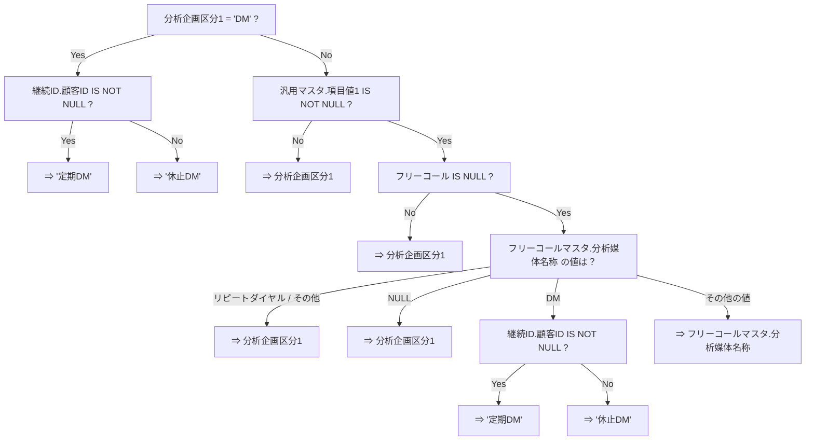
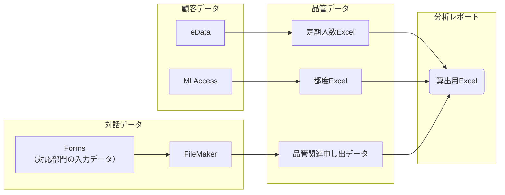

企画フローチャート

```mermaid
flowchart TD

A["分析企画区分1 = 'DM' ?"] -->|Yes| B["継続ID.顧客ID IS NOT NULL ?"]
B -->|Yes| B1["⇒ '定期DM'"]
B -->|No| B2["⇒ '休止DM'"]

A -->|No| C["汎用マスタ.項目値1 IS NOT NULL ?"]
C -->|No| Z["⇒ 分析企画区分1"]

C -->|Yes| D["フリーコール IS NULL ?"]

D -->|No| E["⇒ 分析企画区分1"]

D -->|Yes| F["フリーコールマスタ.分析媒体名称 の値は？"]

F -->|リピートダイヤル / その他| G1["⇒ 分析企画区分1"]
F -->|NULL| G2["⇒ 分析企画区分1"]

F -->|"DM"| H["継続ID.顧客ID IS NOT NULL ?"]
H -->|Yes| H1["⇒ '定期DM'"]
H -->|No| H2["⇒ '休止DM'"]

F -->|その他の値| I["⇒ フリーコールマスタ.分析媒体名称"]
```

品管現状

```mermaid
flowchart　LR
subgraph 分析レポート
     R2(算出用Excel)
end
subgraph 品管データ
    C2[定期人数Excel] --> R2
    D2[都度Excel] --> R2
    A2[品管関連申し出データ] --> R2
end
subgraph 対話データ
    E2[Forms<br>（対応部門の入力データ）] --> G2
%%    F2[LYRA] --> G2
    G2[FileMaker] --> A2
end
subgraph 顧客データ
    G1[eData] --> C2
    H1[MI Access] --> D2
end
```
