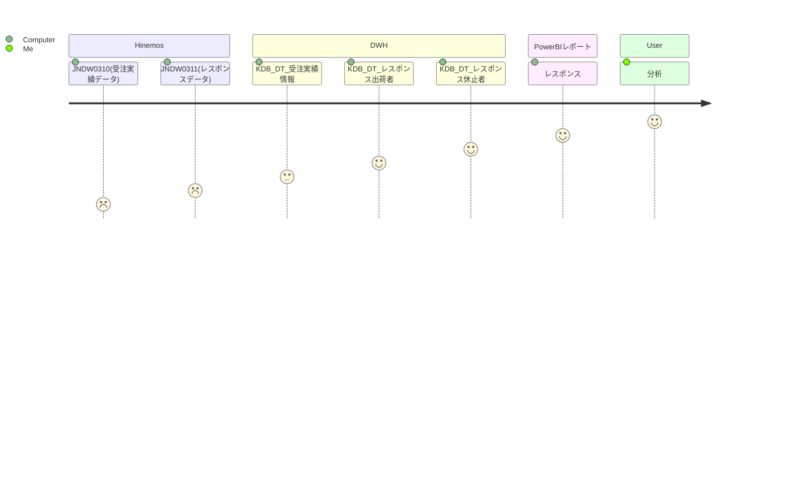
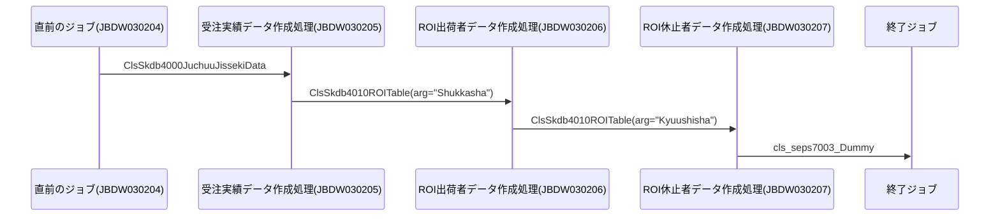
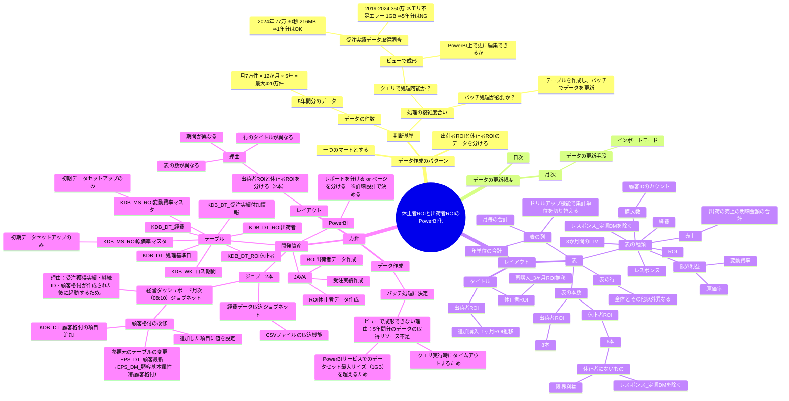

<table>
  <tr>
    <th>文書名</th><td>レスポンス</td>
    <th>組織名</th><td>株式会社えがおHD</td>
    <th>システム名</th><td>経営ダッシュボード</td>
    <th>サブシステム名</th><td></td>
  </tr>
  <tr>
    <th>作成者</th><td>斉藤萌</td>
    <th>作成日</th><td>2025/10/20</td>
    <th>最終更新者</th><td>斉藤萌</td>
    <th>最終更新日</th><td>2025/10/24</td>
  </tr>
</table>

# システム構成設計書

## 1. 概要
- 機能名：レスポンスPowerBI化
- 開発対象：レポート表示データ(Java・bat・Hinemos・新規テーブル)、PowerBIレポート(PowerBI)
- 機能の目的・背景：  MIがエクセルで作成している「レスポンス」のPowerBI化

## 2. 業務フロー


## 3. システム構成図



## 4. ジョブネット
- ジョブ管理台帳<br>\\192.168.1.15\■えがお部署フォルダ\■システム部\ITソリューション2課\001_プロジェクト\023_ジョブ標準\50-1.ジョブ管理台帳.xlsx
- ジョブネット図<br>\\192.168.1.15\■えがお部署フォルダ\■システム部\ITソリューション2課\001_プロジェクト\023_ジョブ標準\51-05.ジョブネット図_JUDW_ＤＷＨ.xlsx
- プログラム一覧<br>\\192.168.1.15\■えがお部署フォルダ\■システム部\ITソリューション2課\001_プロジェクト\031_経営ダッシュボード（原田取締役案件）\15.案件\既存PowerBIのデータ作成自動化\プログラム一覧.xlsx

## 5. テーブル設計
　　[テーブル定義書](https://egaogroup.sharepoint.com/:x:/r/sites/shr0012/Shared%20Documents/MI%E3%82%A8%E3%82%AF%E3%82%BB%E3%83%ABPowerBI%E5%8C%96/%E3%83%86%E3%83%BC%E3%83%96%E3%83%AB%E5%AE%9A%E7%BE%A9%E6%9B%B8_%E6%97%A2%E5%AD%98PowerBI%E3%81%AE%E3%83%87%E3%83%BC%E3%82%BF%E4%BD%9C%E6%88%90%E8%87%AA%E5%8B%95%E5%8C%96.xlsx?d=w3211ede16db04e89b176004e8988d1ae&csf=1&web=1&e=1NSOiE)
  
## 6. ER図（Entity Relationship Diagram）


<!--
```mermaid
erDiagram
    %% 元データテーブル（ソース）
    KDB_DT_受注実績情報 {
        DATE 受注日 PK
        NUMBER 顧客ID PK
        VARCHAR 分析企画区分1 PK
        VARCHAR 都道府県
        VARCHAR 会員ステージ
        NUMBER 受注金額
    }

    KDB_DM_出荷売上情報 {
        DATE 対象日 PK, FK
        NUMBER 顧客ID PK, FK
        NUMBER 売上金額
        VARCHAR 会員ステージ
    }

    %% マートテーブル（集計後）
    KDB_DT_レスポンス出荷者 {
        DATE 受注日 PK
        VARCHAR 分析企画区分1 PK
        VARCHAR 都道府県 PK
        VARCHAR 会員ステージ PK
        NUMBER 対象者数
        NUMBER 受注金額
        NUMBER 売上金額
    }

    KDB_DT_レスポンス休止者 {
        DATE 受注日 PK
        VARCHAR 分析企画区分1 PK
        VARCHAR 都道府県 PK
        VARCHAR 会員ステージ PK
        NUMBER 対象者数
        NUMBER 受注金額
        NUMBER 売上金額
    }

    %% 関係（日本語コメント付き）
    KDB_DT_受注実績情報 ||--o{ KDB_DT_レスポンス出荷者 : "集計元（受注）"
    KDB_DM_出荷売上情報 ||--o{ KDB_DT_レスポンス出荷者 : "集計元（売上）"

    KDB_DT_受注実績情報 ||--o{ KDB_DT_レスポンス休止者 : "集計元（受注）"
    KDB_DM_出荷売上情報 ||--o{ KDB_DT_レスポンス休止者 : "集計元（売上）"
-->
 
## 7. フローチャート（Entity Relationship Diagram）
```mermaid
graph TD

%% 第一部：受注実績情報の作成と加工
A[① KDB_DT_受注実績情報テーブル作成<br>※受注日・顧客・企画単位] --> A1[①-1 前月の受注実績情報を追加<br>※前月のデータを取得]
A1 <-- A1_2_3[①-1-2-3 分析企画区分1取得] --> A2
A1 --> |・企画除外<br>「休止DM・アウトバウンド」<br>・出荷者を抽出<br>・売上金額→受注日から発送日までの日数が0日以上30日以下のレコードを抽出| G
A1 --> |・企画除外<br>「同梱チラシ・定期DM」<br>・休止者を抽出<br>・売上金額→受注日から発送日までの日数が0日以上100日以下のレコードを抽出| H

%% 分析企画区分1の決定ロジック（詳細分岐）
subgraph 分析企画区分1の取得
  A2[①-1-2-3 分析企画区分1取得（企画）<br>（分析企画区分1を編集）] --> B1[KDB_MS_企画分析情報マスタ.分析企画区分1を取得]
  B1 -->|分析企画区分1が「DM」| C1[区分2は出荷者？]
  B1 -->|分析企画区分1が「DM」以外| D1[企画_フリーコールマスタ.区分に値があるか]

  C1 -->|はい| C2[「定期DM」を設定]
  C1 -->|いいえ| C3[「休止DM」を設定]

  D1 -->|はい| D2[受注実績.フリーコールがNULLか？]
  D1 -->|いいえ| D3[受注実績.分析企画区分1の値を取得]

  D2 -->|分析媒体が「リピートダイヤル」「その他」またはNULL| D3
  D2 -->|分析媒体が「DM」| E1[区分2は出荷者？]
  D2 -->|いいえ| D3

  E1 -->|はい| E2[「定期DM」を設定]
  E1 -->|いいえ| E3[「休止DM」を設定]

  C2 --> F1[分析企画区分1が確定]
  C3 --> F1
  D3 --> F1
  E2 --> F1
  E3 --> F1
end

%% 第二部：出荷者レスポンスデータ作成フロー
G[② レスポンス出荷者用のデータ作成<br>※受注月・企画・会員ステージ・新規or再購入・出荷者or休止者 単位]

%% 第三部：休止者レスポンスデータ作成フロー
H[③ レスポンス休止者用のデータ作成<br>※受注月・企画・会員ステージ・新規or再購入・出荷者or休止者 単位]


%% 出力
G --> I[④ PowerBIに表示する]
H --> I
```

## 8. 非機能要件
## 9. その他
### 分析資料(マインドマップ)

