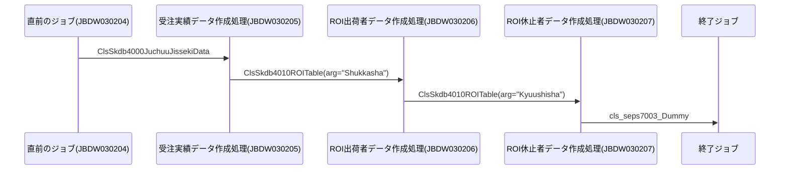
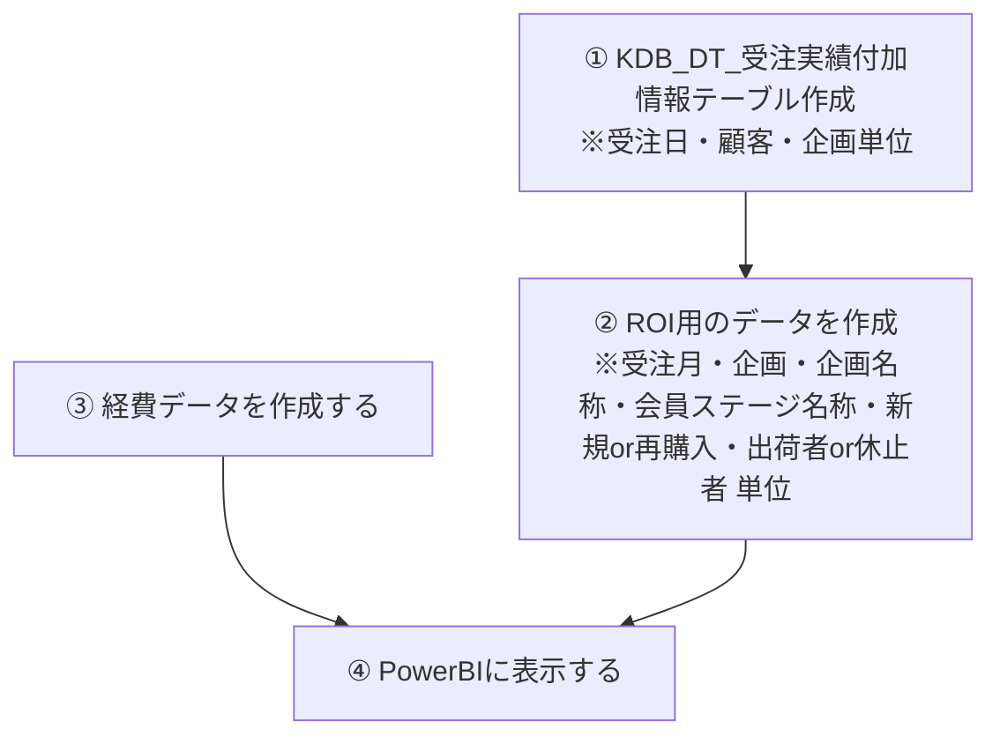
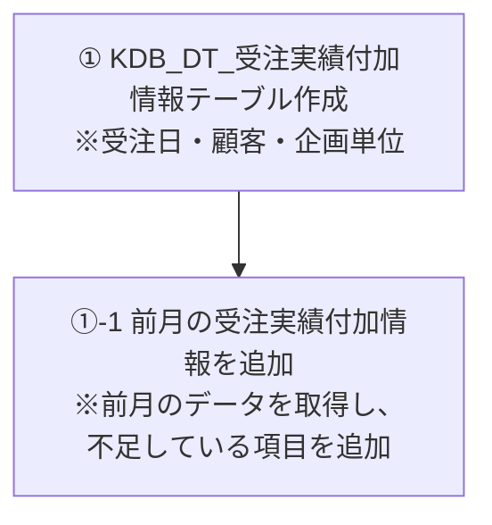

# システム構成設計書

## 1. 概要
- 機能名：レスポンスPowerBI化
- 開発対象：Java、PowerBI
- 機能の目的・背景：  MIがエクセルで作成している「レスポンス」のPowerBI化
## 2. システム構成図

## 2. ジョブネット
　　ここにジョブ管理台帳、ジョブネット図のリンクをはる。

## 3. テーブル設計
　　ここにテーブルレイウトのリンクをはる。
  
## 4. ER図（Entity Relationship Diagram）
　　ここにかく

  
## 5. フローチャート（Entity Relationship Diagram）

