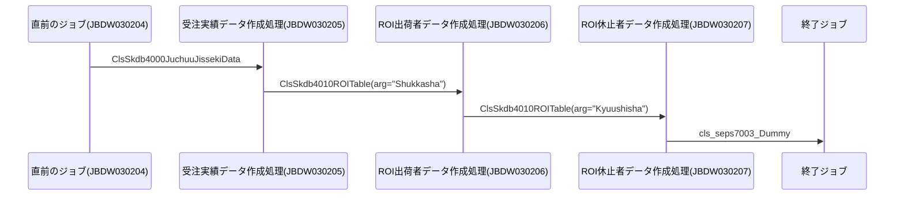
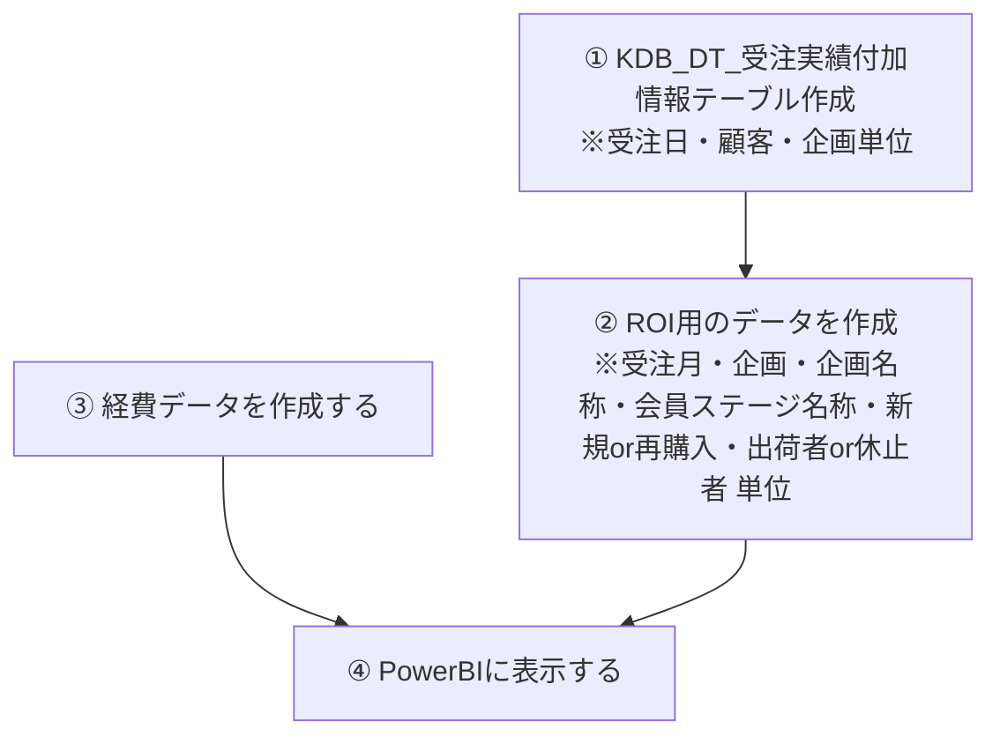
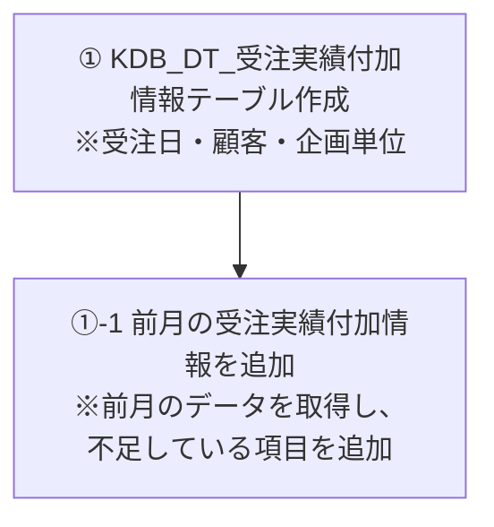

# システム構成設計書

## 1. 概要
- 機能名：レスポンスPowerBI化
- 開発対象：Java、PowerBI
- 機能の目的・背景：  MIがエクセルで作成している「レスポンス」のPowerBI化
## 2. システム構成図

## 2. ジョブネット
- ジョブ管理台帳 \\192.168.1.15\■えがお部署フォルダ\■システム部\ITソリューション2課\001_プロジェクト\023_ジョブ標準\50-1.ジョブ管理台帳.xlsx
- ジョブネット図 \\192.168.1.15\■えがお部署フォルダ\■システム部\ITソリューション2課\001_プロジェクト\023_ジョブ標準\51-05.ジョブネット図_JUDW_ＤＷＨ.xlsx

## 3. テーブル設計
　　[テーブル定義書](https://egaogroup.sharepoint.com/:x:/r/sites/shr0012/Shared%20Documents/MI%E3%82%A8%E3%82%AF%E3%82%BB%E3%83%ABPowerBI%E5%8C%96/%E3%83%86%E3%83%BC%E3%83%96%E3%83%AB%E5%AE%9A%E7%BE%A9%E6%9B%B8_%E6%97%A2%E5%AD%98PowerBI%E3%81%AE%E3%83%87%E3%83%BC%E3%82%BF%E4%BD%9C%E6%88%90%E8%87%AA%E5%8B%95%E5%8C%96.xlsx?d=w3211ede16db04e89b176004e8988d1ae&csf=1&web=1&e=1NSOiE)
  
## 4. ER図（Entity Relationship Diagram）
　　ここにかく

  
## 5. フローチャート（Entity Relationship Diagram）

